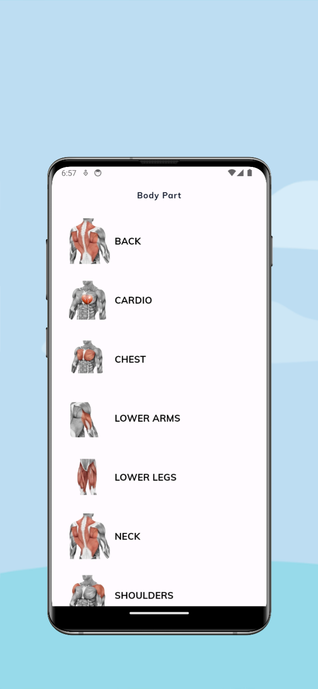
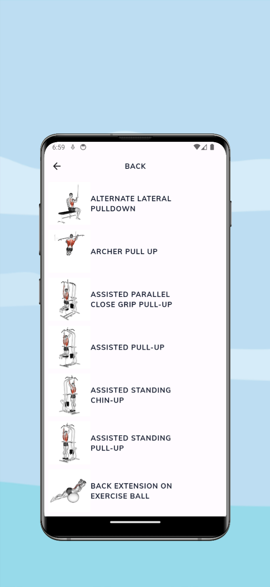
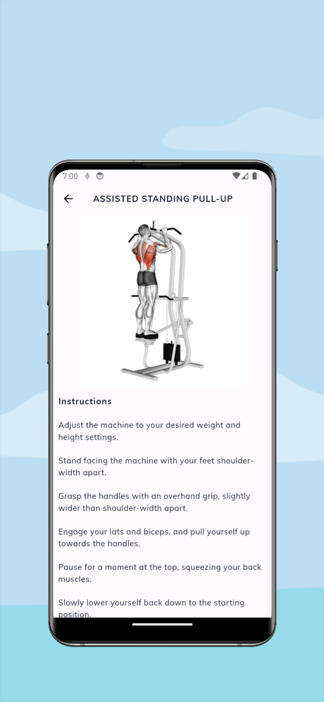

# Build Flutter Fitness GYM application
This is a repository for a Flutter Fitness GYM app your ultimate partner in achieving your fitness, health and wellness goals. Designed to give you a complete gym experience, this powerful and user-friendly app will support you every step of your fitness journey.

<h1 align="center">
  SAWADOGO Badini Ibrahim
</h1>

## About this Repository

# Getting Started
Follow the steps below to run the app on your local machine. You'll need to make sure you have flutter installed along with that Android Studio and XCode installed too in order to test this application in a simulator. Let me know if you encounter issues with the app

1. Make sure to have flutter installed on your machine
2. Clone the repo to your local machine
3. Open an emulator and run command 'flutter run' <Without quotes> within the cloned repo's folder.
4. Try it out.

# API
This application uses the free API whose link is provided below.

https://rapidapi.com

# Screenshot Android

A few resources to get you started if this is your first Flutter project:

- [Lab: Write your first Flutter app](https://flutter.dev/docs/get-started/codelab)
- [Cookbook: Useful Flutter samples](https://flutter.dev/docs/cookbook)

For help getting started with Flutter, view
[online documentation](https://flutter.dev/docs), which offers tutorials,
samples, guidance on mobile development, and a full API reference.
